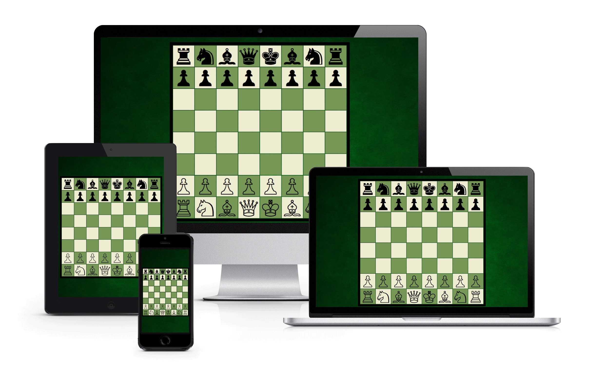

# ChessJS
It is web chess game for one player against a computer. You can play the game on different devices from personal computer to smartphones
with access on the internet. Diversity support responsive design used in game, it capable adapt on any screen size. Algorithm Toledo is
used as artificial intelligence for game, it has only 1024 KB size. Algorithm is smallest implementation on the world, but still support
three levels: begginer, mediator and expert. Algorithm contains limits, you can play only with white stones and and algorithm does not very
good player with queen.

Here is detail explain algorithm Toledo: http://nanochess.org/chess4.html.

## Technologies
* HTML
* CSS
* Javascript

## Access
If you like play the chess game, click on this [link](http://www.jiricaga.cz/chess/).
